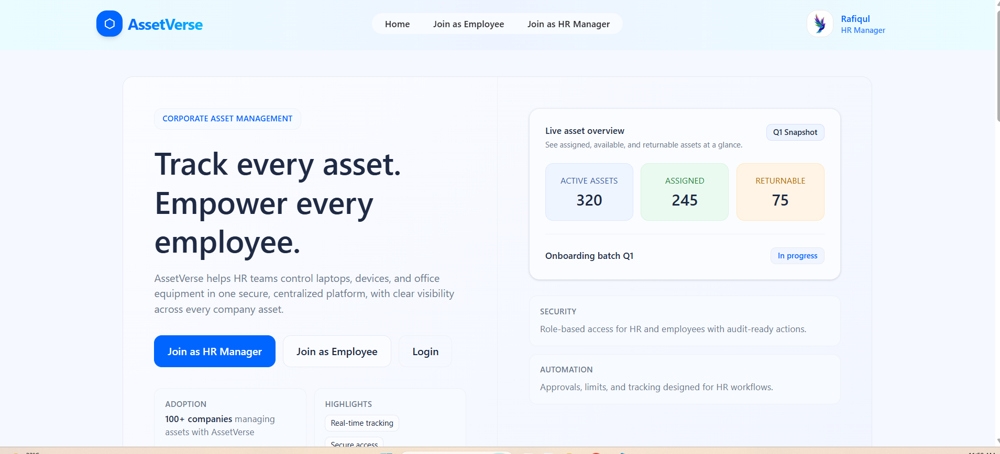
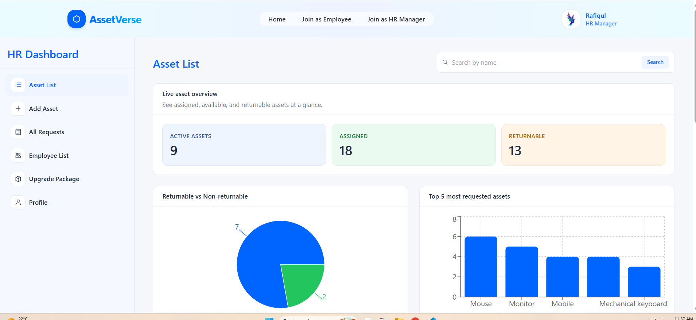
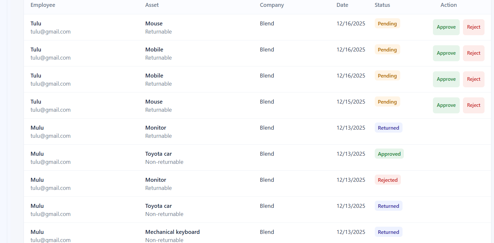
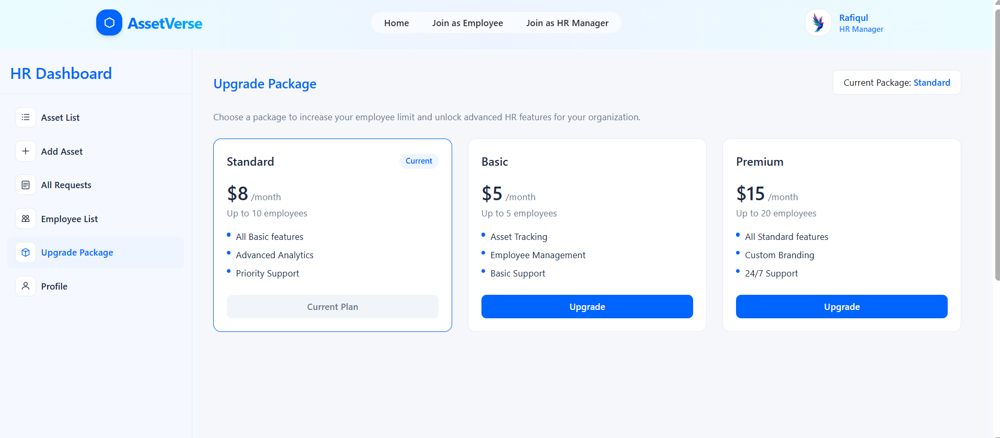

# AssetVerse (Corporate Asset Management)

## Purpose
Corporate Asset Management System for HR managers and employees.

## 🚀 Live Demo
[https://assetversee.vercel.app](https://assetversee.vercel.app)

## Server API
https://assetverse-server.onrender.com

---

# Demo Screenshots
## 🌐Public pages


<br><br>

## 👔HR Dashboard




<br><br>

## 🧑‍💼Employee Dashboard


## Key Features
### HR Manager
- Add, list, delete assets  
- Approve / Reject asset requests  
- Auto employee affiliation  
- Employee list with assigned asset count  
- Remove employee (auto-return system)  
- Upgrade package using Stripe  
- Dashboard analytics using Recharts  
- Publish company notices  
- Update company profile  

### Employee
- Request assets from multiple companies  
- View assigned assets (search + filter)  
- Return returnable assets  
- Print assigned assets (react-to-print)  
- View team members & birthdays  
- View company notices  
- Update personal profile  

### General
- Firebase Authentication + JWT backend auth  
- Protected routes based on role  
- Responsive UI using TailwindCSS v4 + DaisyUI  
- Clean corporate UI  

---

## Tech Stack
- React (Vite)
- React Router
- Firebase Authentication
- TailwindCSS v4
- DaisyUI
- Axios
- React Hot Toast
- Recharts
- React-to-Print

---

## NPM Packages Used
- react  
- react-dom  
- react-router-dom  
- firebase  
- axios  
- react-hot-toast  
- recharts  
- react-to-print  
- tailwindcss  
- daisyui  

---

## Setup Instructions
```bash
git clone https://github.com/Avishek02/assetverse.git
cd assetverse-client
npm install
npm run dev
```

---

## Environment Variables
Create a `.env` file in the project root:

```
VITE_API_BASE_URL=your_server_url

VITE_FIREBASE_API_KEY=your_firebase_key
VITE_FIREBASE_AUTH_DOMAIN=your_firebase_auth_domain
VITE_FIREBASE_PROJECT_ID=your_firebase_project_id
VITE_FIREBASE_STORAGE_BUCKET=your_firebase_bucket
VITE_FIREBASE_MESSAGING_SENDER_ID=your_sender_id
VITE_FIREBASE_APP_ID=your_app_id
```

---


### API Base URL

For quick testing, you can use the hosted server:

VITE_API_BASE_URL=https://assetverse-server.onrender.com

Or, if you want to run your own server locally, replace this with your own backend URL.


## Test Credentials
```
HR Email: hr@testcompany.com
HR Password: hrtest1234
```

```
Employee Email : tulu@gmail.com
Employee Password : tulu1234

```

---

## Project Structure
```
src/
  api/
  components/
  layouts/
  pages/
  providers/
  routes/
```
---

## Features Completed
- Authentication system  
- HR & Employee dashboards  
- Asset management  
- Request system  
- Auto-affiliation logic  
- Return system  
- Team view  
- Notices  
- Stripe integration  
- Analytics  
- PDF/Print  
- Responsive UI  

---


